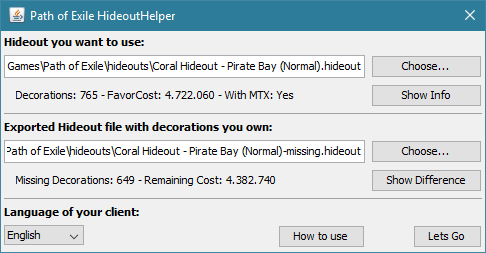
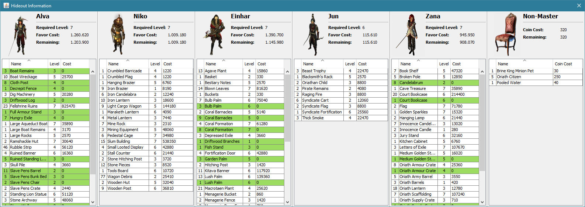
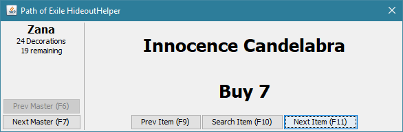

# Path of Exile Hideout Helper

This small tool helps you to import shared Hideouts from other Users by automating decoration search for masters.

[**Check here how to use it**](https://github.com/Jukkales/PoE-Hideout-Helper/blob/master/HOWTO.md)

[**Download Latest Version**](https://github.com/Jukkales/PoE-Hideout-Helper/releases/latest)

## Detailed Hideout Information

  
You can view a complete overview of hideout-files, exported from Path of Exile.
If you also provide a file with decorations you own, everything you own will be highlighted.
  

## Overlay to help you

An overlay guides you trough all masters, highlights decorations in-game and shows how many decorations you need to buy. 
The overlay can be controlled by a mouse or hotkeys. 
  

### For Developers

To build the project just import it as regular Maven-project in your IDE. To generate an executable file just run ``mvn package``.

The Project has two modules: The application itself, and a GGPK-export-parser which generates the resources for the application. 
